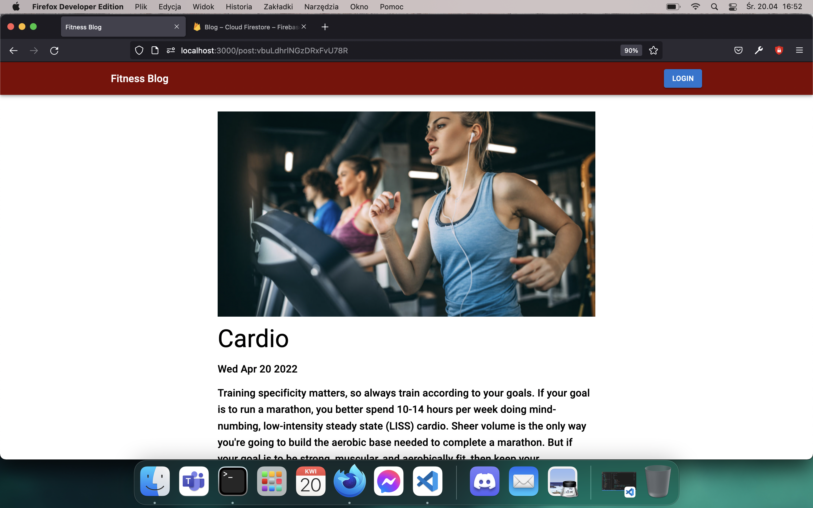

# What I Used To Build This Application?

- REACT
- TypeScript
- Material UI
- Firebase as a backend

# Link to The Webiste:
  https://loquacious-blini-c489da.netlify.app/

# Features

As a Viewer:

- Reading posts and commenting them.

As an Administrator:

- Login to your account.
- Creating new posts and deleting them.

# Reflections

- It was really small project, I've used a lot of inline styles which makes my code look like spagetti. With this small project is doesn't matter but Im aware that in the real world it would not be so great solution.
- I choose Type Script to practise this language more and I've realized that its a better way to write application, with the help of the interfaces I knew very quickly what props component is taking.

# Screenshots

